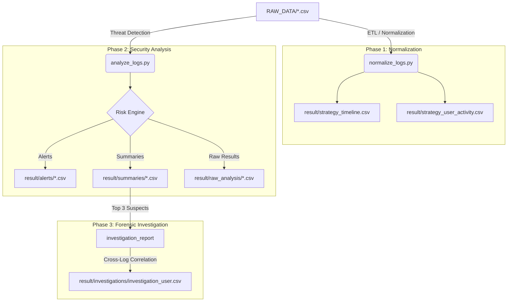

# Cyber Security Log Analyzer 🛡️

[English](#english-version) | [繁體中文](#繁體中文版本)

---

## 繁體中文版本

一套基於 Python 的自動化威脅偵測與數位鑑識工具鏈，旨在從海量異質日誌中提取攻擊行為並自動重建攻擊鏈。

### 🚀 AI 快速導覽 (AI Context)
- **核心目標**: 自動化偵測 8 類日誌中的異常，並針對高風險使用者生成調查時間軸。
- **技術棧**: Python 3.x, Pandas (ETL & Analysis).
- **進入點**: `main.py` (全量自動執行) 或 `analyze_logs.py --user [name]` (定向調查)。

### 🔄 資料流與檢索邏輯 (Data Flow)



### 檢索路徑 (Retrieval Paths)
1.  **原始資料**: `RAW_DATA/` (包含 Auth, DNS, Email, Endpoint, File, FW, Netflow, USB)。
2.  **全域視圖**: `result/strategy_timeline.csv` (10萬+筆日誌按時間排序)。
3.  **威脅清單**: `result/alerts/` (高優先級告警)。
4.  **調查報告**: `result/investigations/` (最關鍵產出，按使用者彙整的完整攻擊足跡)。

---

## English Version

A Python-based automated threat detection and digital forensics toolkit designed to extract attack behaviors from massive heterogeneous logs and automatically reconstruct attack chains.

### 🚀 AI Quick Context
- **Core Goal**: Automate anomaly detection across 8 log types and generate investigation timelines for high-risk users.
- **Tech Stack**: Python 3.x, Pandas (ETL & Analysis).
- **Entry Points**: `main.py` (Full automation) or `analyze_logs.py --user [name]` (Targeted investigation).

### 🔄 Data Flow & Retrieval Logic

(Refer to the Mermaid diagram in the Chinese section above.)

### Retrieval Paths
1.  **Source Data**: `RAW_DATA/` (Includes Auth, DNS, Email, Endpoint, File, FW, Netflow, USB).
2.  **Global View**: `result/strategy_timeline.csv` (100k+ records sorted by timestamp).
3.  **Threat Intelligence**: `result/alerts/` (High-priority security alerts).
4.  **Forensic Reports**: `result/investigations/` (The primary output: consolidated attack footprints per user).

---

## 🔍 分析維度 / Analysis Vectors

| 維度 / Vector | 偵測邏輯 / Logic | 輸出檔案 / Output |
| :--- | :--- | :--- |
| **Initial Access** | Phishing filtering, Brute force stats | `email_threats.csv`, `brute_force_summary.csv` |
| **Execution** | PowerShell/CMD anomalies, Masquerading | `suspicious_processes.csv`, `process_masquerading_alerts.csv` |
| **Network** | DNS Beaconing, Abnormal exfiltration | `dns_beaconing_alerts.csv`, `suspicious_outbound_traffic.csv` |
| **Exfiltration** | Risk scoring (Time/Action/Sensitivity) | `critical_file_alerts.csv`, `top_risky_users.csv` |

---

## 🛠️ 快速開始 / Quick Start

### 1. Install Dependencies
```bash
pip install pandas
```

### 2. Full Analysis (Generate all reports)
```bash
python main.py
```

### 3. Targeted User Investigation
```bash
python analyze_logs.py --user nancy
```

---

## 📂 目錄規範 / Directory Standards
- `/RAW_DATA`: Source CSV log files.
- `/result`: Categorized outputs (alerts, summaries, investigations, raw_analysis).
- `Analyze_Strategy.md`: Detailed detection rules implementation list.
